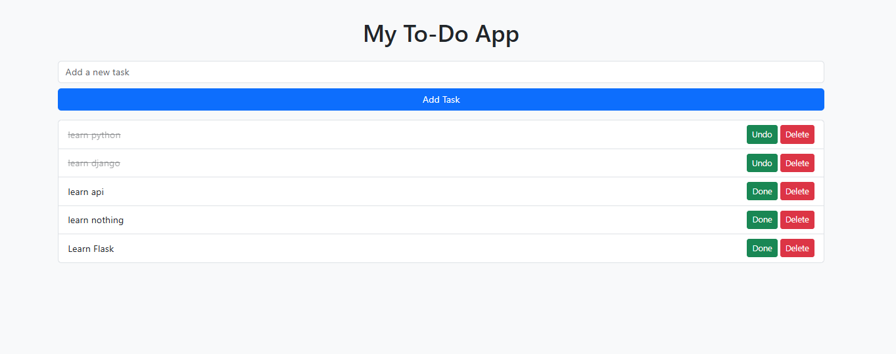

# Flask To-Do App 📝

A **professional To-Do application** built with Flask, featuring **task management, AJAX, SocketIO, Flask-Admin, SQLAlchemy, and a modern responsive UI**.  

---

## ✨ Features

- Task list with **Done / Pending** status and color indicators  
- Add tasks dynamically without page refresh using **AJAX**  
- **Real-time updates** across clients with **SocketIO**  
- Task management through **Flask-Admin dashboard**  
- Database integration with **SQLAlchemy**  
- Welcome banner using **Cookies**  
- **Modern, responsive UI** with clean styling  

---

## 🎨 Screenshots

  
  

---

## ⚙️ Installation & Setup

1. **Clone the repository**
   ```bash
   git clone https://github.com/username/flask-todo-app.git
   cd flask-todo-app
   ```

2. **Create a virtual environment (recommended)**
   ```bash
   python -m venv venv
   source venv/bin/activate   # On Linux/Mac
   venv\Scripts\activate      # On Windows
   ```

3. **Install dependencies**
   ```bash
   pip install -r requirements.txt
   ```

4. **Run the app**
   ```bash
   flask run
   ```
   The app will be available at:  
   👉 `http://127.0.0.1:5000`

---

## 📂 Project Structure

```
flask-todo-app/
│
├── app.py                # Main application
├── requirements.txt      # Dependencies
├── README.md             # Project documentation
├── .gitignore            # Ignored files for Git
├── static/               # Static files (CSS, JS, images)
│   └── style.css
├── templates/            # HTML templates
│   └── index.html
└── migrations/           # Database migrations (if using Flask-Migrate)
```

---

## 🔥 Tech Stack

- **Flask** (Python microframework)  
- **Flask-SocketIO** (real-time communication)  
- **Flask-Admin** (admin panel)  
- **SQLAlchemy** (ORM for database)  
- **AJAX / JavaScript** (dynamic front-end interactions)  
- **HTML5 + CSS3** (modern UI)  

---

## 📜 License

This project is licensed under the **MIT License**.  
Feel free to use and modify it for your own projects. 🚀  
َ